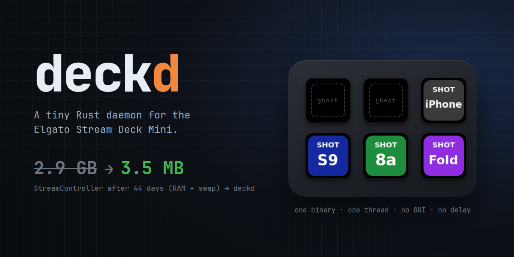

<p align="center">
  
</p>

# deckd

A tiny daemon for the Elgato **Stream Deck Mini** on Linux. Each key shows an icon and runs a
shell command when you press it. That is the whole feature list, on purpose.

|                   | StreamController (before) | deckd            |
|-------------------|---------------------------|------------------|
| RAM, fresh start  | 275 MB                    | **3.5 MB**       |
| RAM over time     | 2.9 GB (RAM + swap) after 44 days | no growth over 50 reloads and 200 commands (tested in the build) |
| Ghost keys        | every press held 250 ms (my fork's filter) | faulty keys left unmapped, **no delay** |
| Startup to keys drawn | — | **71-76 ms** (measured on the device) |
| Runtime           | Flatpak, Python, GTK      | one 940 KB binary|

## Requirements

The brief for the rewrite had two hard numbers, and both are enforced by tests in the build:

1. **Under 10 MB of RAM**, and no growth over time. `tests/rss.rs` runs the release binary through
   50 config reloads and 200 commands: 3.5 MB, and it fails the build above 10 MB or on more
   than 1 MB of growth.
2. **Start in under 100 ms.** `tests/startup.rs` checks exec to config loaded (about 3 ms).
   On the real deck, systemd start to all six keys drawn is 71-76 ms; the rest is the USB
   transfer of the key images.

## Why

My Stream Deck Mini runs four commands: each one grabs a screenshot from a phone on my desk and
puts it in the clipboard. StreamController did that job well, until I noticed it holding 2.9 GB
after six weeks open. Four buttons do not need a GUI toolkit, a plugin store, and a Python
runtime. So deckd is the smallest thing that does the job:

- **one binary, one thread, no GUI, no async runtime**;
- **one TOML file**, reloaded when you save it;
- **a memory test in the build**: the release binary must stay under 10 MB and must not grow over
  50 config reloads and 200 commands, or the build fails.

## How it was made

I did not write this in Rust myself — I do not know Rust. [Claude Code](https://claude.com/claude-code)
wrote it, and other LLMs (Codex, GLM, Grok) reviewed the plan and every pull request through my
[ship-feature](https://github.com/hamen/ship-feature) pipeline. My part was the brief, the
two numbers above, the hardware facts, and pressing the buttons.

## Features

- Icon + shell command per key. A key with no command does nothing.
- Hot reload. A config with any error — bad TOML, unknown field, missing icon — is rejected as a
  whole, and the previous one stays on the deck.
- Reconnects by itself after an unplug, and redraws.
- Same-key debounce, and at most one running instance per key, so a slow command cannot pile up.
- Child processes never inherit the device handle (`close_range` before `exec`).
- Runs as a systemd user service. Logs go to the journal.

## The ghost key

**This is not a factory-fresh deck.** My Mini has worn membranes under the top-left and
top-middle keys: they send a press by themselves
when a neighbouring key moves. StreamController (in my fork) filtered this by holding **every**
press for 250 ms. deckd takes the simpler route: those two keys have no command, so a ghost press
cannot run anything, and the keys that work fire with no delay at all.

Your deck may have a different faulty key, or none. That is why the install below checks for
ghosts **before** any key gets a command.

## Install

Needs a Rust toolchain and `libudev-dev`. Your user needs access to the device's hidraw node
(a udev rule with `TAG+="uaccess"` for `0fd9:0063`).

> **Coming from StreamController?** Quit it first: only one program can drive the deck. It also
> talks to the device through libusb and detaches the kernel HID driver, so after you quit it,
> **unplug and replug the deck** once — otherwise there is no `/dev/hidraw` node for deckd.

**1. Build and install** (this does not start anything):

```sh
git clone https://github.com/hamen/deckd && cd deckd
bin/install                        # ~/.local/bin/deckd, the user unit, an example config
```

**2. Check for ghost keys — required.** Run deckd with an empty config, so no key can run
anything, and press every key you plan to use, several times:

```sh
: > /tmp/empty.toml
DECKD_CONFIG=/tmp/empty.toml DECKD_DEBUG=1 ~/.local/bin/deckd
# deckd: t=1234ms key 2x0 DOWN   <- one line per key press / release; Ctrl-C when done
```

A key that goes DOWN without being touched is a ghost: **leave it without a command**. If a key
you need is a ghost, deckd is not the right tool for that key (it has no delay filter).

**3. Configure and start:**

```sh
$EDITOR ~/.config/deckd/config.toml  # the example has placeholder commands: replace them
systemctl --user enable --now deckd
journalctl --user -u deckd -f
```

`bin/install` never overwrites your config or existing icons.

## Config

`~/.config/deckd/config.toml` (or `$DECKD_CONFIG`):

```toml
brightness = 75      # 0-100
debounce_ms = 150    # same-key presses closer than this are dropped

[keys."2x0"]         # <col>x<row>: 0x0 1x0 2x0 on top, 0x1 1x1 2x1 below
icon = "~/.config/deckd/icons/iphone.png"
command = "$HOME/.local/bin/iphone-screenshot"
# debounce_ms = 300  # optional per-key override
```

- `~` is expanded in `icon` only. `command` goes to `sh -c` as written.
- Icons are any PNG; they are scaled to the key (80×80).
- A second press of the same key within `debounce_ms` is dropped. So is a press while that key's
  previous command is still running.

## How it works

```
main loop, every 250 ms at most:
  ensure_device()   open by VID/PID (retry every 2 s); on open: brightness + draw all 6 keys
  read_input()      key-state report → press edges → debounce / busy / unmapped → spawn
  reap_children()   try_wait on each running command, no zombies
  reload_config()   (mtime, size) changed? parse + decode icons → swap atomically → redraw
```

Four small modules: `config` (pure parsing), `engine` (pure key logic, time injected), `device`
(the only code that touches hidapi, behind a trait), and `daemon` (the loop). The loop is tested
against a fake device, including both ghost patterns, reconnects, and rejected reloads. Every
test was checked by breaking the code on purpose and watching it go red.

## Development

```sh
bin/setup-dev      # once per clone: enables the pre-push gate
bin/ci             # fmt --check, clippy -D warnings, all tests incl. the RSS guard
bin/make-icons     # regenerate icons/*.png (ImageMagick)
bin/make-header    # regenerate docs/header.png (headless Chrome)
```

`DECKD_DEBUG=1` logs raw key transitions. `DECKD_PROBE_ONLY=1` enumerates the deck but never
connects (the RSS test uses it, so it is safe on a machine with a deck plugged in).

Only the original Stream Deck Mini (`0fd9:0063`) is supported and tested.

## License

MIT
